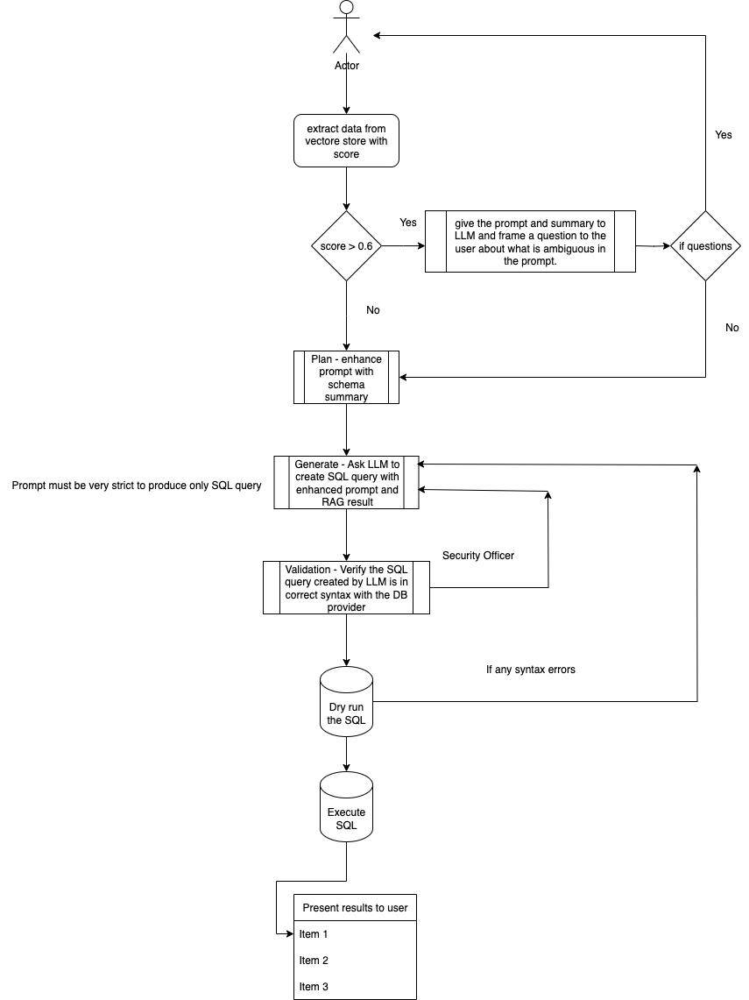

# Chat with your database

Improvements:
1. Use SystemMessage, HumanMessage, and AIMessage from langchain.schema instead of custom classes.
2. To avoid dumb questions from users, add validators at each LLM call(or at-least at the vector search validator) to validate the input.
3. Adjust the prompt to exclude the id columns(PK, FK) in the select query
4. Once max revision is reached for the drafter, respond back to the user with Sorry message
5. 